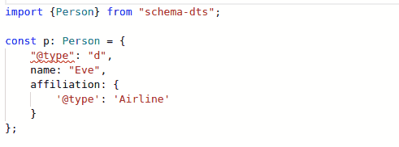

[](https://travis-ci.org/google/schema-dts)
[](https://coveralls.io/github/google/schema-dts?branch=main)
[](https://www.npmjs.com/package/schema-dts)
[](https://www.npmjs.com/package/schema-dts-gen)

# schema-dts

JSON-LD TypeScript types for Schema.org vocabulary.

**schema-dts** provides TypeScript definitions for
[Schema.org](https://schema.org/) vocabulary in JSON-LD format. The typings are
exposed as complete sets of discriminated type unions, allowing for easy
completions and stricter validation.



This repository contains two NPM packages:

- **[schema-dts-gen](https://www.npmjs.com/package/schema-dts-gen)** Providing
  a command-line tool to generate TypeScript files based on a specific Schema
  version and layer.
- **[schema-dts](https://www.npmjs.com/package/schema-dts)** Pre-packaged
  TypeScript typings of latest Schema.org schema, without
  [pending](https://pending.schema.org/) and other non-core layers.

Note: This is not an officially supported Google product.

## Usage

To use the typings for your project, simply add the
[`schema-dts`](https://www.npmjs.com/package/schema-dts) NPM package to your
project:

    npm install schema-dts

Then you can use it by importing `"schema-dts"`.

### Root context

You will usually want your top-level item to include a `@context`, like `https://schema.org`. In order for your object type to accept this property, you can augment it with `WithContext`, e.g.:

```ts
import {Person, WithContext} from 'schema-dts';

const p: WithContext<Person> = {
  '@context': 'https://schema.org',
  '@type': 'Person',
  name: 'Eve',
  affiliation: {
    '@type': 'School',
    name: 'Nice School',
  },
};
```

# Schema Typings Generator

The Schema Typings Generator is available in the
[**`schema-dts-gen`**](https://www.npmjs.com/package/schema-dts-gen) package.

    npm install schema-dts-gen
    npx schema-dts-gen --ontology=https://schema.org/version/latest/schemaorg-all-https.nt

Command line usage:

- **Specify your ontology**

  - Specify **`--ontology`**: An HTTPs URL to an .nt NTriple file declaring your
    ontology.

    Must be compatible with Schema.org, including the Schema.org `DataType`s and
    specifying a top-level `Thing` type.

- **`--context`**: Defaults to `https://schema.org`, the value or values to be
  used with the `"@context"` property.

  Can be either a single URL, or a comma separated list of two or more name:URL
  pairs.

  The context affects names of string properties in types, as well as the values
  of an object's `"@type"`.

- **`--deprecated`**/**`--nodeprecated`**: Whether or not to include deprecated
  Schema.org types and properties. When included, these types will still be
  marked with `@deprecated` JSDOC tags.

- **`--verbose`**: Outputs additional logs and debugging notes to stderr.

## Developers

Use NPM to install dependencies:

    npm install

We have wrappers around `tsc` and `tsc --build` to build our generator other
.d.ts files.

To generate TypeScript from the latest Schema.org Schema:

    npm run build-gen && npm run build-schema

or simply build the schema-dts generator:

    npm run build-gen

To contribute changes, see [the CONTRIBUTING.md file](./CONTRIBUTING.md).
