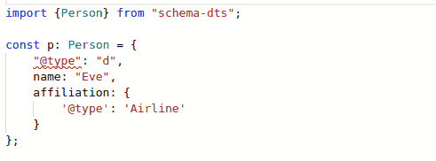

[](https://github.com/google/schema-dts/actions/workflows/ci.yml)
[](https://coveralls.io/github/google/schema-dts?branch=main)
[](https://www.npmjs.com/package/schema-dts)
[](https://www.npmjs.com/package/schema-dts-gen)

# schema-dts

JSON-LD TypeScript types for Schema.org vocabulary.

**schema-dts** provides TypeScript definitions for
[Schema.org](https://schema.org/) vocabulary in JSON-LD format. The typings are
exposed as complete sets of discriminated type unions, allowing for easy
completions and stricter validation.



This repository contains two NPM packages:

- **[schema-dts-gen](https://www.npmjs.com/package/schema-dts-gen)** Providing a
  command-line tool to generate TypeScript files based on a specific Schema
  version and layer.
- **[schema-dts](https://www.npmjs.com/package/schema-dts)** Pre-packaged
  TypeScript typings of latest Schema.org schema, without
  [pending](https://pending.schema.org/) and other non-core layers.

Note: This is not an officially supported Google product.

## Usage

To use the typings for your project, simply add the
[`schema-dts`](https://www.npmjs.com/package/schema-dts) NPM package to your
project:

```sh
npm install --save-dev schema-dts
```

Then you can use it by importing `"schema-dts"`.

### Root context

You will usually want your top-level item to include a `@context`, like
`https://schema.org`. In order for your object type to accept this property, you
can augment it with `WithContext`, e.g.:

```ts
import type {Person, WithContext} from 'schema-dts';

const p: WithContext<Person> = {
  '@context': 'https://schema.org',
  '@type': 'Person',
  name: 'Eve',
  affiliation: {
    '@type': 'School',
    name: 'Nice School',
  },
};
```

### Graphs and IDs

JSON-LD supports `'@graph'` objects that have richer interconnected links
between the nodes. You can do that easily in `schema-dts` by using the `Graph`
type.

Notice that any node can have an `@id` when defining it. And you can reference
the same node from different places by simply using an ID stub, for example
`{ '@id': 'https://my.site/about/#page }` below is an ID stub.

The example below shows potential JSON-LD for an About page. It includes
definitions of Alyssa P. Hacker (the author & subject of the page), the specific
page in this URL, and the website it belongs to. Some objects are still defined
as inline nested objects (e.g. Occupation), since they are only referenced by
their parent. Other objects are defined at the top-level with an `@id`, because
multiple nodes refer to them.

```ts
import type {Graph} from 'schema-dts';

const graph: Graph = {
  '@context': 'https://schema.org',
  '@graph': [
    {
      '@type': 'Person',
      '@id': 'https://my.site/#alyssa',
      name: 'Alyssa P. Hacker',
      hasOccupation: {
        '@type': 'Occupation',
        name: 'LISP Hacker',
        qualifications: 'Knows LISP',
      },
      mainEntityOfPage: {'@id': 'https://my.site/about/#page'},
      subjectOf: {'@id': 'https://my.site/about/#page'},
    },
    {
      '@type': 'AboutPage',
      '@id': 'https://my.site/#site',
      url: 'https://my.site',
      name: "Alyssa P. Hacker's Website",
      inLanguage: 'en-US',
      description: 'The personal website of LISP legend Alyssa P. Hacker',
      mainEntity: {'@id': 'https://my.site/#alyssa'},
    },
    {
      '@type': 'WebPage',
      '@id': 'https://my.site/about/#page',
      url: 'https://my.site/about/',
      name: "About | Alyssa P. Hacker's Website",
      inLanguage: 'en-US',
      isPartOf: {
        '@id': 'https://my.site/#site',
      },
      about: {'@id': 'https://my.site/#alyssa'},
      mainEntity: {'@id': 'https://my.site/#alyssa'},
    },
  ],
};
```

### Input and Output constraints

Actions support additional information to describe inputs and outputs, so each
property can be annotated using `-input` and `-output` suffixes and you can do
that in `schema-dts` by using the `WithActionConstraints` type for each action
type you want to annotate. See the following examples:

```ts
import type {SearchAction, WithActionConstraints} from 'schema-dts';

const potentialAction: WithActionConstraints<SearchAction> = {
  '@type': 'SearchAction',
  'query-input': 'required name=search_term_string',
  // ...
};
```

```ts
import type {SearchAction, WebSite, WithActionConstraints} from 'schema-dts';

const website: WebSite = {
  '@type': 'WebSite',
  potentialAction: {
    '@type': 'SearchAction',
    'query-input': 'required name=search_term_string',
  } as WithActionConstraints<SearchAction>,
};
```

### Real-world examples

Below are common patterns for using `schema-dts` types when building JSON-LD for
real websites.

#### Organization and WebSite (every site should have these)

```ts
import type {Organization, WebSite, WithContext} from 'schema-dts';

const org: WithContext<Organization> = {
  '@context': 'https://schema.org',
  '@type': 'Organization',
  name: 'Acme Corp',
  url: 'https://acme.com',
  logo: 'https://acme.com/logo.png',
  sameAs: ['https://twitter.com/acme', 'https://www.linkedin.com/company/acme'],
};

const site: WithContext<WebSite> = {
  '@context': 'https://schema.org',
  '@type': 'WebSite',
  name: 'Acme Corp',
  url: 'https://acme.com',
};
```

#### Product with Offer (e-commerce)

```ts
import type {Product, WithContext} from 'schema-dts';

const product: WithContext<Product> = {
  '@context': 'https://schema.org',
  '@type': 'Product',
  name: 'Classic Leather Wallet',
  description: 'Full-grain leather bifold wallet with RFID blocking.',
  image: 'https://shop.example/images/wallet.jpg',
  sku: 'WALLET-001',
  brand: {
    '@type': 'Brand',
    name: 'Example Shop',
  },
  offers: {
    '@type': 'Offer',
    price: 89,
    priceCurrency: 'USD',
    availability: 'https://schema.org/InStock',
    url: 'https://shop.example/products/classic-wallet',
  },
};
```

#### FAQPage (content sites)

```ts
import type {FAQPage, WithContext} from 'schema-dts';

const faq: WithContext<FAQPage> = {
  '@context': 'https://schema.org',
  '@type': 'FAQPage',
  mainEntity: [
    {
      '@type': 'Question',
      name: 'Do you ship internationally?',
      acceptedAnswer: {
        '@type': 'Answer',
        text: 'Yes, we ship to over 50 countries.',
      },
    },
    {
      '@type': 'Question',
      name: 'What is your return policy?',
      acceptedAnswer: {
        '@type': 'Answer',
        text: 'We offer a 30-day return policy on all items.',
      },
    },
  ],
};
```

#### Article (blog posts)

```ts
import type {Article, WithContext} from 'schema-dts';

const article: WithContext<Article> = {
  '@context': 'https://schema.org',
  '@type': 'Article',
  headline: 'How to choose a leather wallet',
  datePublished: '2026-03-01',
  dateModified: '2026-03-15',
  author: {
    '@type': 'Person',
    name: 'Jane Smith',
    url: 'https://blog.example/authors/jane',
  },
  image: 'https://blog.example/images/wallet-guide.jpg',
  description: 'A practical guide to choosing a leather wallet that lasts.',
};
```

#### Injecting JSON-LD into HTML

When serializing JSON-LD for injection into a `<script>` tag, escape characters
that could break out of the tag or enable XSS:

```ts
function safeJsonLd(data: WithContext<Thing>): string {
  return JSON.stringify(data)
    .replace(/</g, '\\u003C')
    .replace(/>/g, '\\u003E')
    .replace(/&/g, '\\u0026')
    .replace(/'/g, '\\u0027');
}

// Use in HTML:
// <script type="application/ld+json">${safeJsonLd(product)}</script>
```

> **Tip:** See [`examples.md`](./examples.md) for more integration patterns,
> including React, Next.js, Astro, and other frameworks.

# Schema Typings Generator

The Schema Typings Generator is available in the
[**`schema-dts-gen`**](https://www.npmjs.com/package/schema-dts-gen) package.

```sh
npm install --save-dev schema-dts-gen
npx schema-dts-gen --ontology=https://schema.org/version/latest/schemaorg-all-https.nt
```

Command line usage:

- **Specify your ontology**
  - Specify **`--ontology`**: An HTTPs URL to an .nt NTriple file declaring your
    ontology.

    Must be compatible with Schema.org, including the Schema.org `DataType`s and
    specifying a top-level `Thing` type.

- **`--context`**: Defaults to `https://schema.org`, the value or values to be
  used with the `"@context"` property.

  Can be either a single URL, or a comma separated list of two or more name:URL
  pairs.

  The context affects names of string properties in types, as well as the values
  of an object's `"@type"`.

- **`--deprecated`**/**`--nodeprecated`**: Whether or not to include deprecated
  Schema.org types and properties. When included, these types will still be
  marked with `@deprecated` JSDOC tags.

- **`--verbose`**: Outputs additional logs and debugging notes to stderr.

## Developers

Use NPM to install dependencies:

```sh
npm install
```

We have wrappers around `tsc` and `tsc --build` to build our generator other
.d.ts files.

To generate TypeScript from the latest Schema.org Schema:

```sh
npm run build-gen && npm run build-schema
```

or simply build the schema-dts generator:

```sh
npm run build-gen
```

To contribute changes, see [the CONTRIBUTING.md file](./CONTRIBUTING.md).
